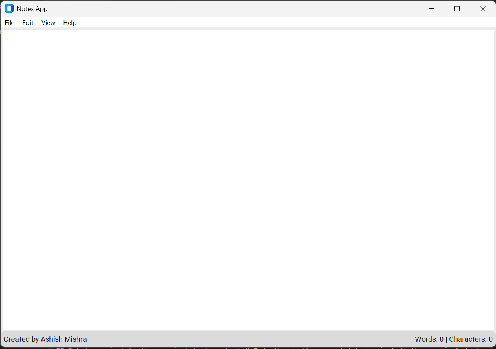

# note_maker

# NoteMaker

A simple yet powerful note-taking application built with Python, customtkinter, and tkinter.

## Features

- **Text Formatting**: Apply bold, italic, underline, and multiple combinations to selected text
- **Font Size**: Change text size dynamically
- **Text Alignment**: Left, center, and right alignment options
- **File Operations**: Create new notes, save, open, and export as PDF
- **Search & Replace**: Find and replace text within notes
- **Auto-save**: Automatically saves notes with timestamps
- **Theme Toggle**: Switch between light and dark themes
- **Pin Note**: Keep the window on top of other applications
- **Word Count**: Displays word and character count in real-time
- **Keyboard Shortcuts**:
  - Ctrl+S: Save note
  - Ctrl+F: Search text
  - Ctrl+E: Export as PDF

## Screenshots




## Requirements

- Python 3.6+
- customtkinter
- tkinter
- reportlab

## Installation

1. Clone this repository:
```bash
git clone https://github.com/your-username/notemaker.git
cd notemaker
